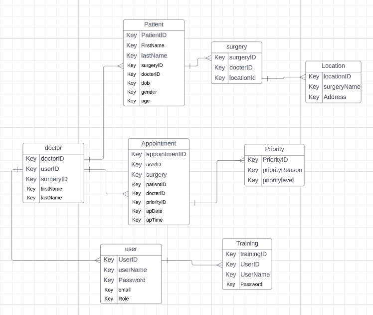
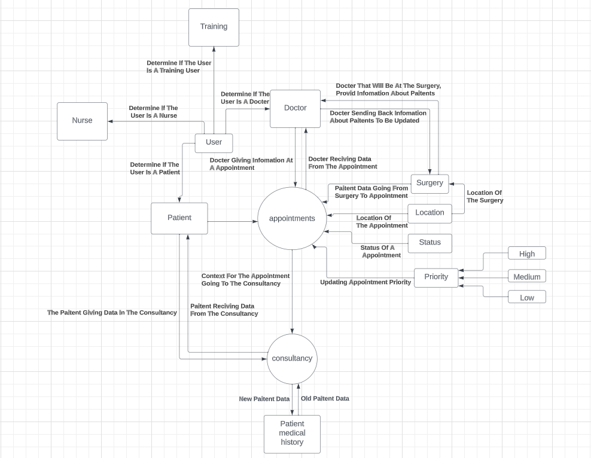
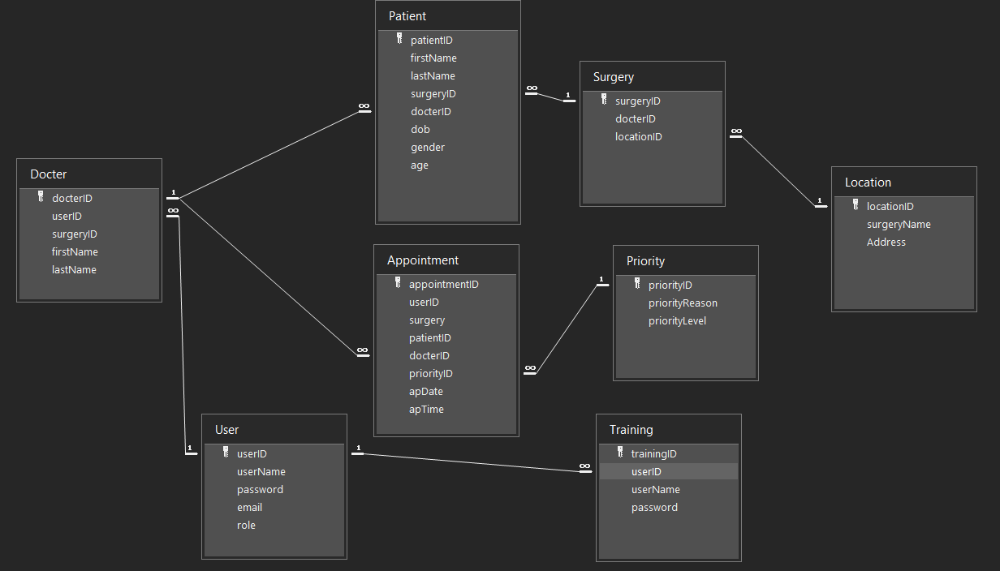
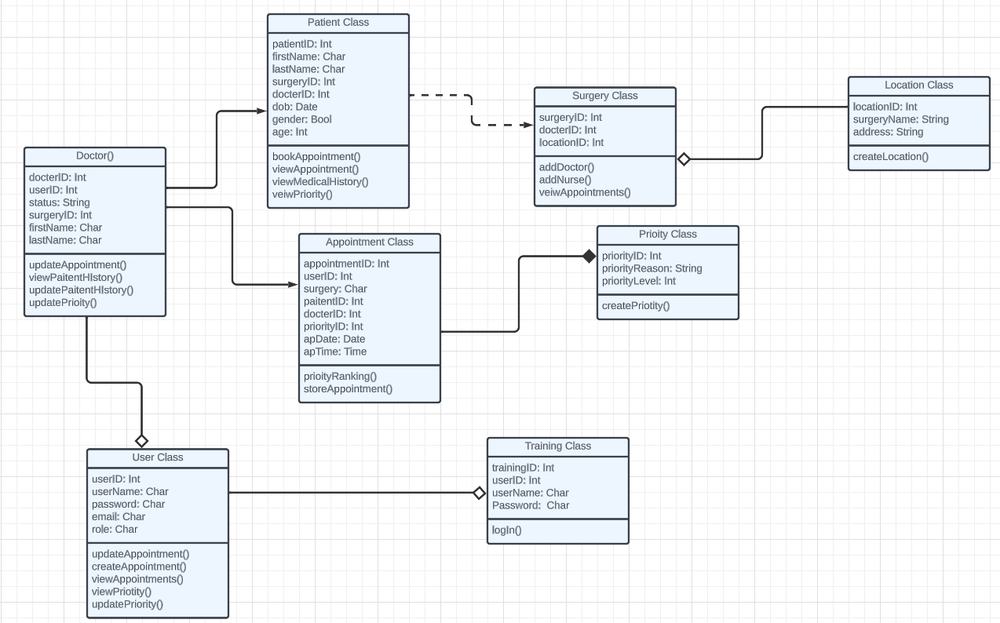
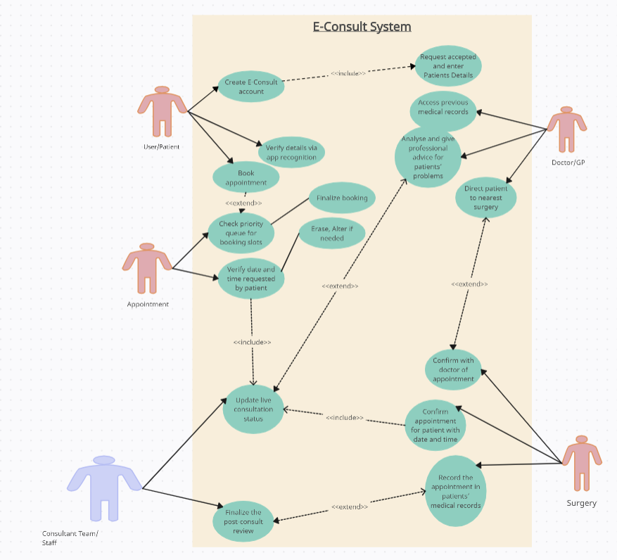
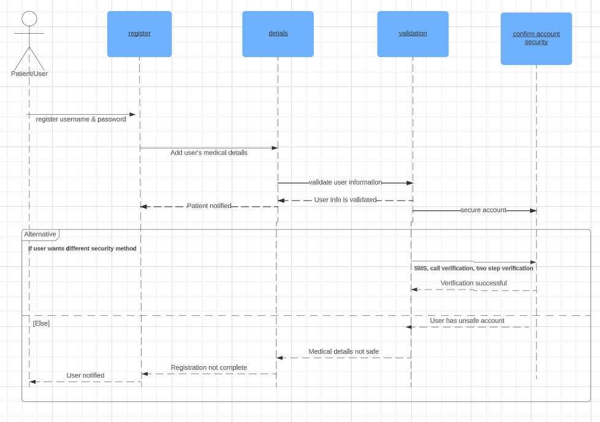
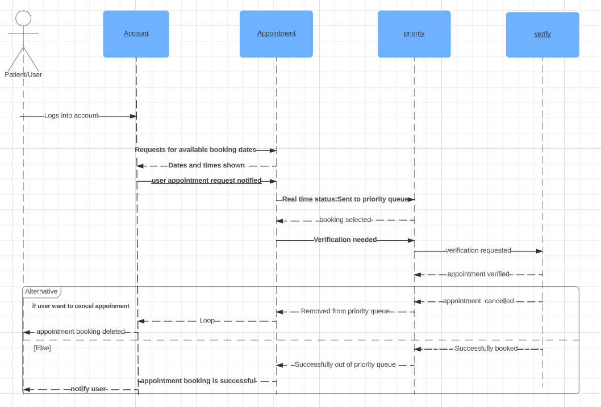
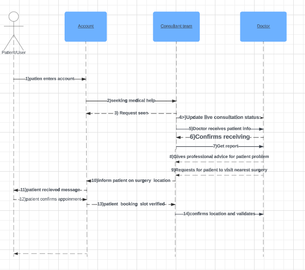

# E-Consult Prototype Database

A relational database designed and built for **e-Consult**, an online GP consultation
and triage platform, as part of a group coursework project for *COMP1821 – Principles
of Software Engineering* (University of Greenwich).

The brief: redesign and extend an existing patient consultation app so it supports
real-time appointment status, priority-based triage, and access to patient history —
while staying within an £800k budget and an 18-month delivery window. The team used
Agile (Scrum), with the group split across product, development, QA and design roles.

## My contribution

I was the team's **Product Owner** and individually designed and built the **prototype
database**:

- Full schema design (8 entities: `Patient`, `Docter`, `Surgery`, `Location`,
  `Appointment`, `Priority`, `User`, `Training`) covering patients, GPs, surgeries,
  appointments and priority-based triage
- Physical database diagram
- All SQL queries needed to support the system's core operations

## Contents

| File | Description |
|---|---|
| `schema.sql` | Table definitions (primary/foreign keys included) |
| `queries.sql` | The six core operations: add/update/delete a patient, book an appointment, check an appointment's status, and view a patient's appointment history |
| `images/` | ERD, DFD, physical database diagram, UML class diagram, use case diagram, and sequence diagrams |

## Design

**Entity Relationship Diagram** — conceptual data model for patients, doctors, surgeries and appointments

**Data Flow Diagram** — level 0 (context) diagram of the system's processes

**Physical database diagram** — the schema as implemented

**UML class diagram**

**Use case diagram**

**Sequence diagrams** — patient login, booking an appointment, and doctor referral

## Tech

Built and prototyped in **MS Access**, with SQL translated here into standard syntax
for portability.

## Requirements covered

- Add / update / delete a patient
- Add an appointment
- View the live status of an appointment
- View a patient's full appointment history (patient ID, surgery, time)

## Note

This repo shows the schema and query logic only — the populated sample data used for
testing (which included team members' own names and test login details) has been left
out, since it wasn't ours to publish.
